Scrambled
========

External Enumeration
--------------------

We'll first run a portscan against the target 10.10.11.168, here I'm using my bash alias `fscan`

`fscan 10.10.11.168`

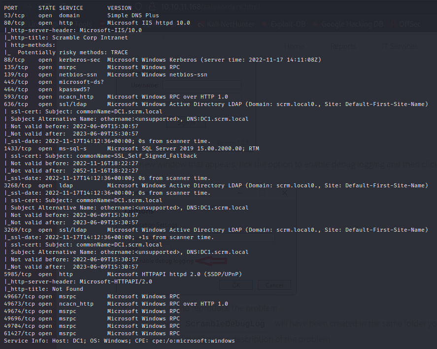

We see all the typical open ports of a domain controller and the nmap scan reveal the FQDN of the domain controller: **dc1.scrm.local**

I'll add **scrm.local** and **dc1.scrm.local** to my `/etc/hosts` file

Usually I'd start with quickly checking for unauthenticated access to SMB or RPC using 
```
smbclient -N -L \\10.10.11.168
crackmapexec smb 10.10.11.168 -u '' -p ''
smbmap -H 10.10.11.168
rpcclient 10.10.11.168 -N
```
but all receieve <b>NT_STATUS_NOT_SUPPORTED</b> errors, the reason for which we discover upon navigating to the website

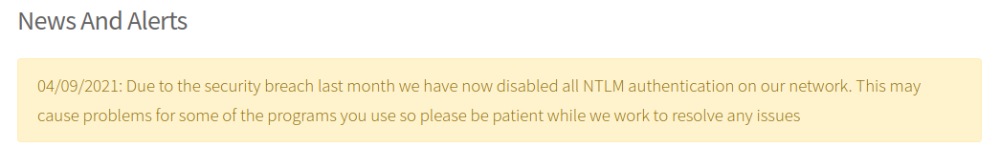

It appears NTLM authentication has been disabled across the domain, so any authentications will have to use Kerberos.

Exploring the page further reveals a further two items of interest:

- We have a potential username of **ksimpson**

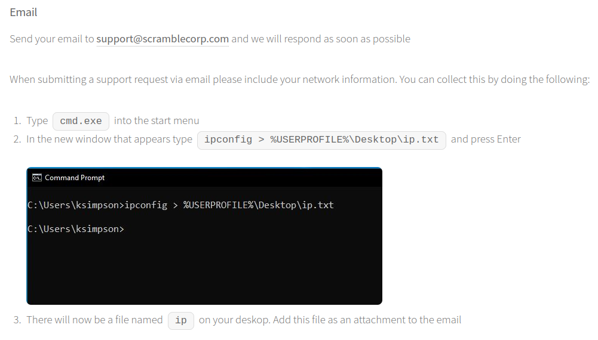

- Passwords are being reset as the username of the account

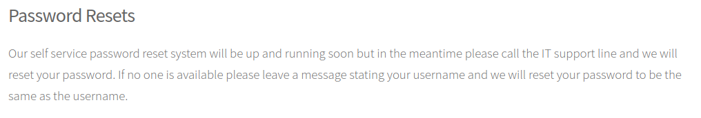

From here we can do two things:

1. Use kerbrute to verify that ksimpson is in fact a domain user
2. Authenticate using kerberos to see if I can access any shares over SMB using the credentials ksimpson:ksimpson

I'll use `kerbrute` for the former and impacket's `smbclient.py` for the latter.

Kerbrute's userenum works by sending a request for a TGT, and if **UF_DONT_REQUIRE_PREAUTH** is not set for this user (which it usually isn't) the DC will respond with either

1. A PRINCIPAL UNKNOWN error and the username does not exist
2. Or the DC will prompt for pre-authentication, in which case the user exists in the domain

The command line for this looks like 

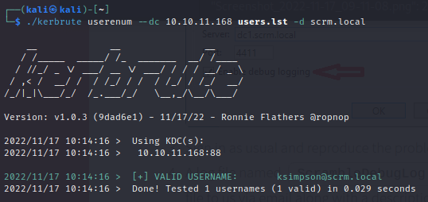

and we see **ksimpson** is a valid username

Next we check `smb` using the `-k` flag to enforce kerberos authentication

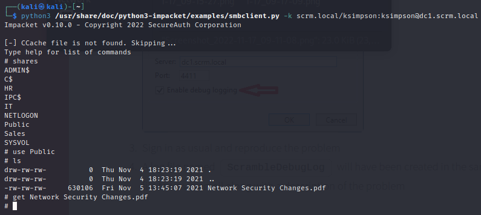

Enumerating all the shares we find we only have access to the `Public` share which contains a single file **Network Security Changes.pdf**

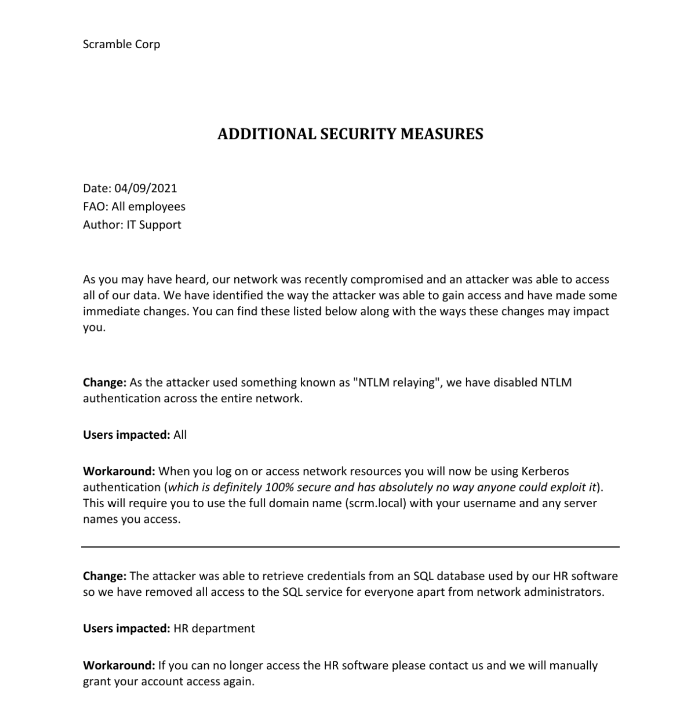

Kerberoasting & Silver Ticket Attack
------------------------------------

The pdf points to a SQL Service active in the domain. A common attack vector regarding services in active directory is **kerberoasting**, and the tool of choice for this is impacket's `GetSPNUser.py`. The way this works is that each instance of a service in active directory has to be tied to a unique logon account through a **Service Principal Name** (SPN), so an SPN is just an account<--->service mapping. Since the KDC doesn't verify if we have sufficient privilege to access the service (it's left up to the service to do this), we can request a TGS from the KDC for any and every service. The server portion of the TGS is encrypted with a key derived from the password hash of the user account tied to the service in the SPN, so we can offline brute force the password for the account by guessing a password, hashing it and seeing if it will correctly decrypt the server portion of the TGS.

Running the command returns a response for the MSSQLSvc user

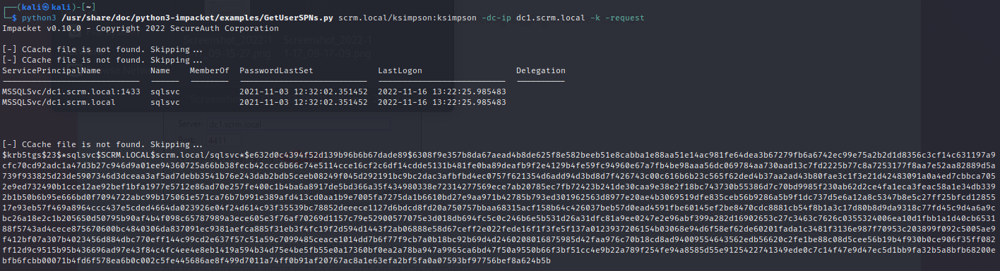

Saving the blob into a file `hash` and using my alias `j hash` we find the credentials **MSSQLSvc:Pegasus60**

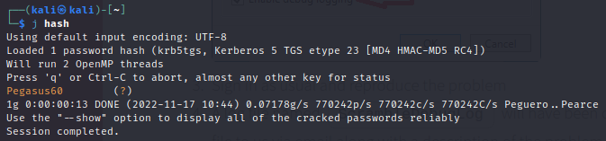

Though the PAC in the server portion of the TGS is signed using the KDC long-term secret AND the target service long-term secret, a TGS is rarely passed off to the KDC for PAC validation. As a result, since we have the MSSQLSvc password, we can forge our own TGS for the service. This is known as a silver ticket attack.

We need three things to do this:
1. The domain SID
2. The NT hash of the password for the service account
3. The SPN

For the NT hash we can do 
`iconv -f ASCII -t UTF-16LE <(printf "Pegasus60") | openssl dgst -md4`
which returns **b999a16500b87d17ec7f2e2a68778f05**

We have the SPN already which is **MSSQLSvc/dc1.scrm.local**

And to get the domain SID, impacket has a script `GetPAC.py` which retrieves the PAC of any user in the domain and the PAC contains the SID of that user, so stripping of that user's RID we have the domain SID.

Running this script targeting the administrator (which always has RID 500) 

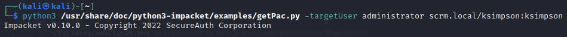

We get a domain SID of 

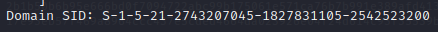

Now we can use impacket's `ticketer.py` to forge our TGS, identifying ourselves as the administrator to the MSSQL service

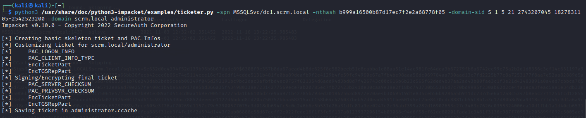

This saves the ticket into `administrator.ccache`
From <https://web.mit.edu/kerberos/krb5-1.12/doc/basic/ccache_def.html>

'A credential cache (or “ccache”) holds Kerberos credentials while they remain valid and, generally, while the user’s session lasts, so that authenticating to a service multiple times (e.g., connecting to a web or mail server more than once) doesn’t require contacting the KDC every time.'

Initial Access
--------------

Now we can authenticate to the SQL server as the administrator which should let us do some interesting stuff. Impacket has a script `mssqlclient.py` which will let us authenticate to the service using our forged ticket. 

On Linux, kerberos looks for tickets in pre-defined locations, one being the environment variable `KRB5CCNAME` so I'll need to export the ticket to this environment variable.
I'll run 
1. `export KRB5CCNAME=~/administrator.ccache`
2. `mssqlclient.py -k scrm.local/admnistrator@dc1.scrm.local -no-pass` to enter a session on the SQL server


