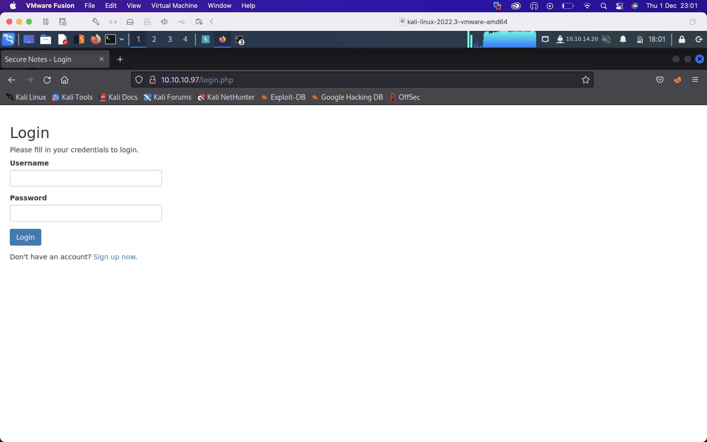
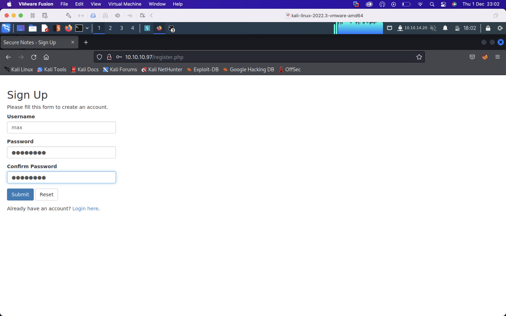
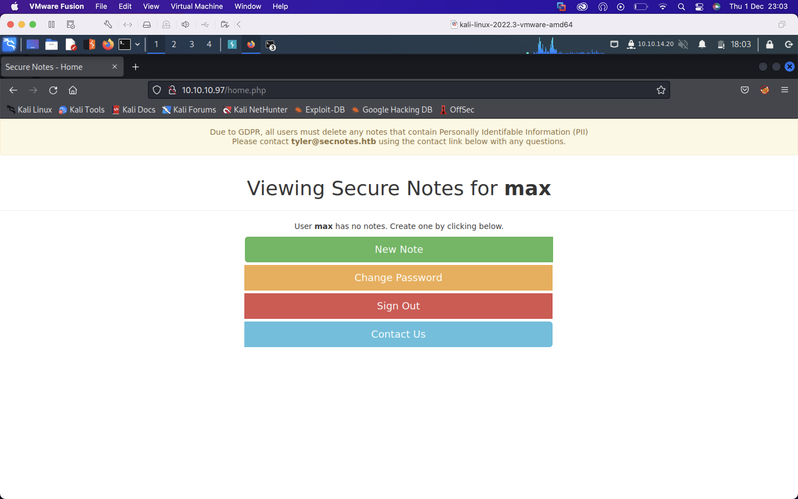

SecNotes was a medium difficulty Windows box. Being an earlier HTB box it wasn't as involved as some of the more recent medium boxes. The initial foothold involved getting finding credentials to access a share over SMB which can be done via an XSRF or a second order SQL injection. The share is the webroot of a development site into which we can write a PHP reverse shell. The privilege escalation involved finding credentials in a history file in Windows Subsystem for Linux from which we can psexec into the box as the administrator. I'll also into the artifacts psexec leaves behind.

I'll first run a port scan against the box using my alias `fscan`

We see ports 80,445,8808 are open. Ports 80 and 8808 are running `Microsoft IIS httpd 10.0` though nmap shows are redirect to `login.php`. 

Visiting the website shows a login form with an option to signup

I'll signup with the credentials `max:password`

Logging in 

There's a contact form where we can send a message to `tyler@secnotes.htb`. If tyler is clicking on links we may be able to perform XSS/XSRF

