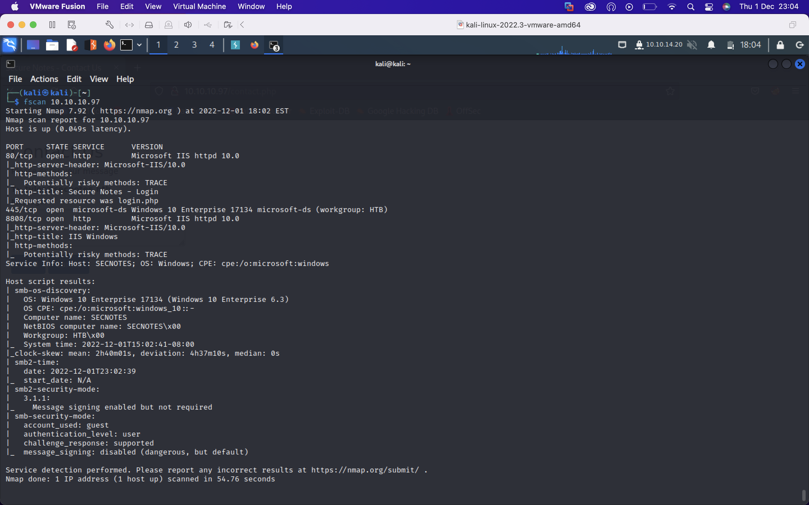

SecNotes was a medium difficulty Windows box. Being an earlier HTB box it wasn't as involved as some of the more recent medium boxes. The initial foothold involved getting finding credentials to access a share over SMB which can be done via an XSRF or a second order SQL injection. The share is the webroot of a development site into which we can write a PHP reverse shell. The privilege escalation involved finding credentials in a history file in Windows Subsystem for Linux from which we can psexec into the box as the administrator. I'll also into the artifacts psexec leaves behind.

I'll first run a port scan against the box using my alias `fscan`

