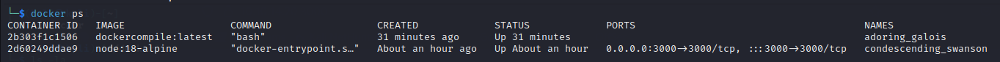
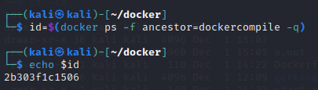
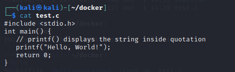
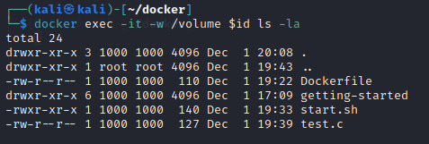
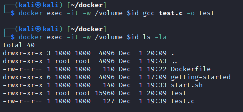
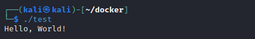

# What this is

Sometimes in a CTF I land on an ubuntu box and need to compile an exploit. I've had trouble before doing so from a kali host so in the past I spun up an ubuntu docker to compile the code. This automates that procedure. The `Dockerfile` pulls the ubuntu:latest image and installs nano, gcc and python. `start.sh` builds the Dockerfile tagging it as `dockercompile:latest` then runs it in detached mode and mounts the current directory into `/volume` inside the container. So you can write the code in the current directory on the host and compile from inside the ubuntu container or from the command line on the host.

# Example
On my host I ran `./start.sh` to create the `dockercompile:latst` container

I'll grab the container id

On the host I have a C hello world program

